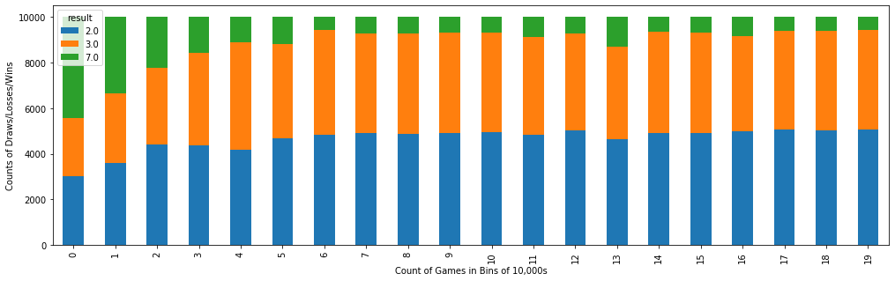
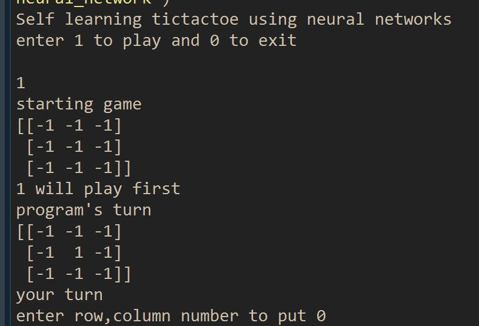
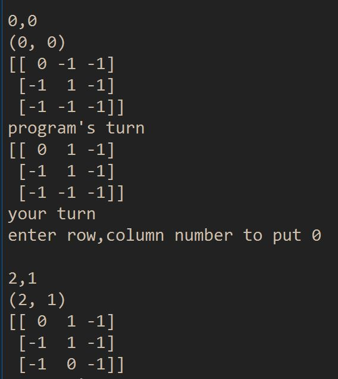
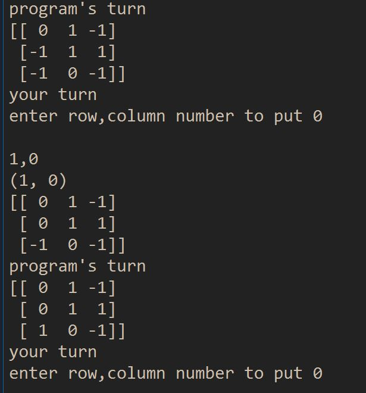
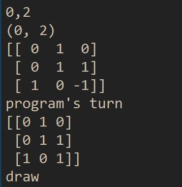

# TicTacToc-nnl
Self learning Tic tac toe game using neural networks.

## TicTacToe_opponent.py
Our program is trained by playing with opponent 200,000 times. Most favorable board state is given higher weight and 
least favorable has less weight. After few games the program learns to give more favorable board state higher weight.

## TicTacToe_human.py
This is our program which uses model trained from playing with the opponent. The model predicts scores and next move for the program.

## TicTacToe.h5
This is model created when programs plays with opponent 200,000 times. This model is used by the program to predict it's next move while 
playing with human.

## TicTacToe.csv
This is the list of wins, loss, and draws of the program against opponent.

## Graphs

7 - losses
3 - draws
2 - wins

## Output
Program plays 1
Opponent plays 0
toss is random
-1 is zero

